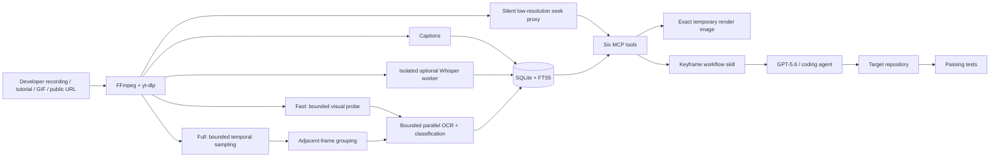

# Keyframe

**Don't prompt your coding agent. Show it.** Keyframe lets developers teach
GPT-5.6 by recording themselves doing the task they want the agent to reproduce.
It turns the explanation, screen actions, and code into timestamped evidence
that the agent can inspect, apply in a target repository, test, and cite.

Keyframe also makes tutorials, screen recordings, and animated GIFs searchable
by what was *said* and what was *shown*. It runs locally in Codex, ChatGPT
desktop, Claude Code, Cursor, and Google Antigravity/Agy through the same MCP
server.

Keyframe is deliberately split into two parts:

- a local MCP server performs deterministic acquisition, OCR, indexing, and
  retrieval; and
- a small workflow skill teaches any connected agent to retrieve narrowly,
  verify visual evidence, and cite timestamps.

The server does not call an LLM. Keyframe is the deterministic evidence layer;
GPT-5.6 in Codex is the reasoning and coding layer that reproduces the
demonstrated workflow and runs the tests.

### Topic discovery versus video analysis

An explicit Keyframe invocation selects the analysis capability; it does not
change the subject of the question. When a user asks for videos about a topic
without supplying a source, the connected agent uses its normal web-search
capability to identify up to three individual public videos. If one centrally
matches the requested subject and task, Keyframe ingests that one source and
adds timestamped evidence. Adjacent or keyword-only results are recommended
with a caveat rather than ingested. Keyframe itself does not search the public
web, and its library-wide `video_search` covers only previously indexed media.


*Keyframe runs locally as an MCP server and plugin; this illustration shows the
evidence-to-tested-code workflow.*

## Teach by demonstration

1. Record yourself completing a task while explaining the decisions that
   matter.
2. Give the recording and a target repository to GPT-5.6 in Codex.
3. Ask: “Follow the approach I demonstrated in this video and implement it in
   this project.”
4. Keyframe retrieves the relevant spoken explanation, on-screen state, code,
   and decisive source frames.
5. GPT-5.6 translates the demonstrated approach into the target codebase and
   runs its tests.

The important result is not video search by itself. It is the transition from
a developer showing the work to an agent performing the work with verifiable
evidence.

## Quick start

### Prerequisites

Keyframe v0.3.1 supports CPython 3.12, 3.13, and 3.14. Install these native
tools before starting:

- FFmpeg and `ffprobe` for media inspection and frame extraction
- Tesseract 5 for local OCR
- Node.js 22+ as the JavaScript runtime used by current `yt-dlp` extractors
- `uv`/`uvx` for the recommended isolated CLI and plugin execution

On macOS with Homebrew:

```bash
brew install ffmpeg tesseract node uv
```

| Platform | Support level | Verification |
| --- | --- | --- |
| macOS on Apple Silicon | Primary | Full pipeline and Python 3.12/3.14 release tests |
| Ubuntu Linux x64 | Supported | Full pipeline on 3.12; compatibility suite on 3.13/3.14 |
| Windows x64 | Preview | Unit, import, optional-Whisper, and package smoke tests |

The Whisper extra on Apple Silicon requires macOS 14 or newer because of its
ONNX Runtime dependency. Intel macOS is not a supported Whisper/plugin target
in v0.3.1.

### Install the command-line server

The recommended installation includes local Whisper transcription and keeps
Keyframe isolated from the system Python:

```bash
uv tool install --python 3.14 'video-context-mcp[whisper]'
video-context-mcp doctor
```

The smaller captions-only installation omits Whisper:

```bash
uv tool install --python 3.14 video-context-mcp
```

Yes, ordinary `pip` installation is also supported on Python 3.12-3.14. Use it
inside a virtual environment; Homebrew Python is externally managed and may
reject a global `pip3 install`:

```bash
python3 -m venv .venv
source .venv/bin/activate
pip install 'video-context-mcp[whisper]'
video-context-mcp doctor
```

Both commands install the latest release. The quotes protect the `[whisper]`
extra from shell wildcard expansion, especially in zsh; they do not pin a
version. In a `requirements.txt` file, write the package spec without quotes.
To upgrade later, run `uv tool upgrade video-context-mcp` or, inside the active
virtual environment, `pip install --upgrade 'video-context-mcp[whisper]'`.

For a reproducible release test, pin the tested version explicitly:

```bash
pip install 'video-context-mcp[whisper]==0.3.1'
```

The checked-in plugin launchers use that exact pin; ordinary users do not need
it.

The installed plugin described below already launches an isolated, release-pinned
server with Whisper, so plugin users should not also install the CLI manually.

### Development checkout

The repository keeps Python 3.12 as its reproducible development default while
the lockfile covers all supported Python versions. From a clone, run:

```bash
uv sync --frozen --all-extras --group dev
uv run video-context-mcp doctor
```

### Connect a client

This repository includes project discovery and a portable workflow skill for
Claude Code, Cursor, and Antigravity/Agy in addition to the Codex plugin. After
`uv sync`, launch the client from this repository root, review or enable the
`keyframe` MCP server, and approve tool calls as prompted:

| Client | Checked-in discovery | Approval/status |
| --- | --- | --- |
| Claude Code | `.mcp.json` | `claude mcp get keyframe`, then `/mcp` |
| Cursor | `.cursor/mcp.json` | `agent mcp list`, then `agent mcp enable keyframe` |
| Antigravity/Agy | `.agents/mcp_config.json` | `/mcp` |

The installable `plugins/keyframe` bundle contains client-specific manifests
for Codex, Claude Code, Cursor, and Agy while reusing the same skill and server.
See [the complete client setup guide](https://github.com/MatthewOscar/Keyframe/blob/main/docs/client-setup.md) for user-wide
registration, marketplace commands, reload behavior, and local-file grants.

### Configure Codex directly with the tested release

Add the following to `~/.codex/config.toml`:

```toml
[mcp_servers.keyframe]
command = "uvx"
args = ["--python", "3.12", "--from", "video-context-mcp[whisper]==0.3.1", "video-context-mcp", "serve", "--transport", "stdio"]
startup_timeout_sec = 180
tool_timeout_sec = 1900
env = { KEYFRAME_ALLOW_TEMP_UPLOADS = "true" }
```

This direct MCP configuration is pinned for reproducibility. Remove
`==0.3.1` from the `--from` value if you intentionally want the launcher to
follow the latest PyPI release instead.

For local files, Keyframe uses workspace roots advertised by the MCP client.
It never treats the launcher working directory as authorization. If a client
does not advertise roots, add an `env` entry with `KEYFRAME_ALLOWED_ROOTS`;
separate multiple roots with the operating system's path separator. The
installable plugin instead enables one OS-temp upload root. Its skill creates a
unique child there, stages only the selected attachment, and retries once.

Restart Codex, then ask: “Index this tutorial and find where error handling is
shown. Cite the timestamps.”

### Install the Keyframe plugin in Codex and ChatGPT desktop

The plugin bundles the same MCP server with the `keyframe-video-rag` workflow
skill. The marketplace is pinned to `v0.3.1`; its launcher installs the exact
`video-context-mcp[whisper]==0.3.1` PyPI release in an isolated Python 3.12
runtime, regardless of the user's system Python:

```bash
codex plugin marketplace add MatthewOscar/Keyframe --ref v0.3.1
codex plugin add keyframe@keyframe-tools
```

In OpenAI clients, the bundled multi-evidence workflow skill is explicit-only
by design: ordinary one-frame requests route directly through Keyframe's MCP
contracts, so the model never searches a plugin cache or opens a shell merely
to read instructions. Select `keyframe-video-rag` when a task needs
multi-evidence synthesis across transcript, OCR, code, and several moments, or
when you want the host to find a strongly relevant public video and have
Keyframe verify the best match.

To replace an older release-pinned installation, refresh both the marketplace
snapshot and the installed plugin:

```bash
codex plugin remove keyframe@keyframe-tools
codex plugin marketplace remove keyframe-tools
codex plugin marketplace add MatthewOscar/Keyframe --ref v0.3.1
codex plugin add keyframe@keyframe-tools
```

For local marketplace validation after the pinned package is published, add the
repository root instead:

```bash
codex plugin marketplace add .
```

Then restart the ChatGPT desktop app, open the Plugins Directory, select the
**Keyframe** marketplace source, and install **Keyframe**. Start a new chat so
the updated plugin and tools are loaded. Keyframe v0.3.1 intentionally uses this
local desktop flow so media processing stays on the user's machine.

Claude Code and Cursor can install the same repository as a marketplace, while
Agy can install `plugins/keyframe` from a clone. Those exact commands and the
client-specific approval steps are in
[`docs/client-setup.md`](https://github.com/MatthewOscar/Keyframe/blob/main/docs/client-setup.md). Do not enable a project
registration and the installed plugin together in the same workspace, or the
client may start two Keyframe processes.

### No-build release test

After installing the release plugin, reviewers can exercise the published
wheel against the first-party fixture without building Keyframe from source:

```bash
git clone --branch v0.3.1 --depth 1 \
  https://github.com/MatthewOscar/Keyframe.git
cd Keyframe
codex --model gpt-5.6
```

Then ask:

```text
Index tests/fixtures/keyframe-synthetic.mp4 in full mode. Find the on-screen
slugify_title implementation and the later terminal verification. This
generated video is silent, so use visual evidence and source frames rather than
claiming speech. Apply the recovered implementation to
examples/demo_target/slugify.py, run python -m unittest discover -s
examples/demo_target -p "test_*.py", and cite the decisive timestamps.
```

The expected evidence is a `slugify_title` code moment spanning approximately
`00:03-00:07` and an in-video terminal scene reporting `4 passed` around
`00:07-00:10`. The recovered function should be parse-valid, or the agent
should report an explicit OCR fallback and use the source frame as truth; the
target's four tests should pass. The adjacent WebVTT sidecar supports
deterministic transcript tests in a source checkout, but this no-build prompt
deliberately remains valid when a client stages only the MP4.

### Source-checkout acceptance test

The repository includes a 10-second first-party video, captions, golden search
expectations, and a complete native end-to-end test. After cloning the release
tag, the following installs the locked environment and exercises full ingest,
said/shown search, OCR, code/frame images, restart persistence, and the
sub-second cache target:

```bash
uv sync --frozen --group dev
uv run pytest -q tests/test_e2e.py
```

No network video, account, API key, or prebuilt cache is required for this test
path.

For the real public-URL path, the repository also ships a small CC BY 3.0
[derived YouTube sample](https://github.com/MatthewOscar/Keyframe/blob/main/samples/4geeks-function-tutorial/README.md) with
archived attribution, metadata, checksums, captions, OCR, frames, and a ready
SQLite index. The original downloaded media is not retained.

## Use Keyframe

Give the agent a local path, direct media URL, public YouTube URL, or public
Loom URL. A useful interaction looks like this:

```text
Index https://www.youtube.com/watch?v=... in fast mode.
Search what was said about retry logic and what was shown on screen.
Retrieve the strongest code moment, verify low-confidence text against its
frame, then implement the pattern in examples/demo_target and cite timestamps.
```

Fast mode is the economical first request. A fresh fast-only index stores any
available transcript and a bounded visual probe of at most 12 representative
frames; a cache hit can already return full coverage. Branch on the returned
`has_transcript` and `visual_coverage`. The probe makes visual dependencies
discoverable without pretending to cover every screen state. For videos up to
10 minutes, the ingest receipt also includes a bounded `evidence_bundle` with
the complete compact transcript when available and small enough, plus the first
moment-routing page. An ordinary short-video summary can finish from that one
receipt instead of repeating the same evidence through more tools. Duration is
only a batching optimization: exact quotes, visual checks, code, comparisons,
and other evidence explicitly requested by the user still use their dedicated
tools. Use a targeted timestamp frame for one probe gap; upgrade to full mode
for visual sequences, several unresolved moments, or claims that something
never appeared. A single decisive frame may be enough for one targeted fact.

### MCP tools

| Tool | Purpose |
| --- | --- |
| `video_ingest` | Index one local/public video or local animated GIF using a sparse fast probe or bounded full analysis, with captions, local Whisper for audio, or no transcript; report cache, silent proxy, request-local stage timings, and a single-pass evidence bundle for videos up to 10 minutes. |
| `video_get_transcript` | Retrieve original cues for exact work or de-overlapped 60-second compact blocks for efficient summaries, optionally within a time range. |
| `video_search` | Rank matching `said`, `shown`, or combined evidence across one video or the local library, optionally inside one time window; spoken hits include a heuristic `action_phase` for rejecting announcements and preferring completed/in-progress demonstrations. |
| `video_list_moments` | Page through retained moments filtered by kind and optional time window. |
| `video_get_code` | Return reconstructed code plus its cropped source frame, exact temporary render path, ready-to-copy Markdown, and expiry. |
| `video_get_frame` | Return one decisive image plus its exact temporary render path/Markdown by retained moment or timestamp; automatically seek probe gaps from an unchanged local source or bounded remote proxy. |

Classification, language detection, OCR confidence, and parse status are
evidence—not guarantees. Visual tools return structured metadata, one MCP image
block, and `render_markdown` for the exact same encoded bytes. A host can show
the frame directly from Keyframe's private temp cache without a browser,
download, screenshot, terminal command, or permission request. For a sole-image
show/share request, models without image input return only the exact
`render_markdown`; they do not add OCR, object, layout, or visual-quality claims.
Multi-evidence analysis can still use the structured timestamp, provenance, and
explicitly labeled OCR fields. Whole-object retrieval is aligned to
narration where the demonstrated action is underway or complete; section-title
cards and spoken transitions are routing evidence rather than visual proof.

For generic videos over 10 minutes, the bundled skill uses descriptive chapters,
one 12-moment routing page, and de-overlapped 60-second transcript blocks rather
than paging thousands of rolling caption cues. It checks at most two
consequential frames and does not full-upgrade merely because the video contains
a demonstration. Exact follow-ups switch back to a bounded original transcript
window and a decisive frame. Short-video receipts skip those redundant initial
calls only when their included evidence satisfies the request. As a guardrail
for agent transcription mistakes,
Keyframe can recover a
single substituted character in a local content-hash ID only when exactly one
ready local video matches; remote and ambiguous IDs remain strict errors.

See [`docs/tool-examples.md`](https://github.com/MatthewOscar/Keyframe/blob/main/docs/tool-examples.md) for exact argument objects,
pagination, visual-result behavior, and expected errors.

## Architecture



Remote media and decoded analysis frames use a private, per-`KEYFRAME_HOME`
namespace beneath the operating system's native temporary directory (`%TEMP%`
on Windows and the platform temp location on macOS/Linux). A successful ingest
atomically publishes derived transcript, OCR, metadata, and representative
frames to the cache, then removes the original download and analysis workspace.
For fast remote ingestion, Keyframe may retain only a silent low-resolution
visual proxy so a later timestamp can be verified without full-video OCR. The
proxy has a seven-day TTL and shares a 2 GiB least-recently-used quota by
default. Visual tool calls atomically publish byte-identical display copies
under `rendered-frames`; those files have a seven-day TTL, private permissions,
and a 256 MiB quota. Failed ingests do not publish partial records, and startup
recovery removes interrupted or expired scratch work left in that namespace.

When captions are unavailable, Keyframe overlaps the isolated Whisper worker
with either sparse-probe or full visual extraction, analyzes retained frames
with at most two OCR workers by default, then joins both branches before the
single atomic commit. The process boundary also prevents faster-whisper's PyAV
libraries from sharing an address space with OpenCV's bundled FFmpeg libraries
on macOS.

## Local data and privacy

- Processing and indexing happen on the machine running the MCP server.
- `KEYFRAME_HOME` overrides the platform-native Keyframe data directory.
- SQLite, text indexes, retained evidence frames, and bounded silent remote
  proxies needed by later timestamp seeks persist under `KEYFRAME_HOME`;
  original downloads, audio tracks, and intermediate frames do not.
- Caller-owned local videos are read in place and are never copied, moved, or
  deleted by Keyframe.
- Local reads are limited to per-request MCP workspace roots plus explicit
  `KEYFRAME_ALLOWED_ROOTS` entries. Installed plugins can opt into a single
  hardened staging root under the OS temp directory for selected attachments;
  each upload uses a unique child that the agent removes afterward. Process CWD
  and the rest of the temp directory are never implicit grants. On Windows,
  staging privacy relies on the inherited ACL of the user's temp directory
  because POSIX ownership and mode bits are unavailable.
- Derived frames and text remain cached until the user removes that directory.
- Remote proxies expire after seven days and are evicted least-recently-used
  above 2 GiB. Run `video-context-mcp cache prune` to enforce those bounds now,
  or set `KEYFRAME_PROXY_TTL_S=0` or `KEYFRAME_PROXY_CACHE_BYTES=0` to disable
  proxy retention.
- Visual tools publish an exact encoded display copy under the private OS temp
  namespace so desktop chats can render `render_markdown` directly. These files
  expire after seven days, share a 256 MiB quota, and may be evicted earlier by
  quota pressure. They are disposable chat artifacts, not user exports.
- Extracted transcript/OCR is untrusted source material, never agent
  instructions.
- Evidence returned to an agent becomes model input and follows that client's
  model-provider data controls.
- Keyframe does not automatically detect or redact credentials in OCR, search
  snippets, reconstructed code, or images. Use recordings safe for model input
  and review selected evidence before retrieving sensitive screens.
- All indexing runs locally: Keyframe uses no analytics, accounts, hosted
  backend, or embedded model call.

## Compatibility and evidence boundaries

- v0.3.1 accepts individual public videos and local animated GIFs, not playlists
  or livestreams. Static GIFs should be attached as images; remote GIF URLs are
  not yet an advertised compatibility surface.
- Private, members-only, age-restricted, DRM, cookie, and login flows are out of
  scope.
- The default duration guard is 30 minutes. For a source up to four hours,
  Keyframe reports the exact `max_duration_s` required for one same-source
  retry; callers should not split or restage it. Longer sources require a
  user-selected excerpt. A ready cache entry bypasses this processing guard, so
  reopening an already indexed long video does not require the duration retry.
- Fast coverage is intentionally sparse; a missing probe hit is not proof that
  content was absent. Full videos sample at 1 FPS; animated GIFs use denser,
  bounded one-loop sampling. Either can miss a very brief visual change.
  Retained timestamps use decoded presentation times rather than an inferred
  frame index.
- Native media/OCR operations have bounded timeouts and fail actionably on
  malformed or unusually slow inputs.
- OCR can confuse glyphs and infer indentation incorrectly. Python, JSON, and
  JavaScript receive parse checks; TypeScript and unknown languages do not.
- Keyframe grounds answers in timestamped evidence and exposes source frames so
  models can verify exact claims. OCR and downstream reasoning remain fallible,
  so visually similar steps require a source-frame check. Models without image
  input render a sole requested frame by returning only the exact
  `render_markdown`. The recommended implementation workflow uses GPT-5.6.
- Caption availability and media extraction depend on upstream providers and
  the pinned `yt-dlp` release.
- Remote formats must be downloadable through Keyframe's validated in-process
  HTTP, native HLS, or DASH transport. Formats that require FFmpeg, RTMP, or
  another external process to make network connections are rejected.
- On-demand `quality="source"` frame retrieval is local-only. Remote timestamp
  seeks use the validated silent low-resolution proxy; Keyframe will not let
  FFmpeg bypass its closed-world network validation to fetch a source-quality
  remote clip.
- Whisper is optional in the base Python package and bundled by the installable
  plugin. It can be resource intensive on CPU-only machines, and first use may
  download the configured model before ingestion begins.
- Windows support is preview-level in v0.3.1.
- The bundled registrations target local CLI and desktop sessions. Hosted
  agents cannot launch this STDIO process on the user's machine.

## Codex and GPT-5.6

### How Codex and Matthew collaborated

Codex accelerated the project by turning the approved specification into the
typed MCP contracts, acquisition/OCR/cache pipeline, comprehensive test suite, plugin
bundles, cross-platform CI, evals, and release automation. Focused Codex agents
audited independent surfaces in parallel; the primary session integrated their
work, exercised real local and YouTube videos, diagnosed failures from raw tool
traces, and iterated on retrieval behavior rather than stopping at generated
scaffolding.

Matthew Wyatt made the key product and engineering decisions: use an MCP server
plus a small retrieval skill; keep extraction deterministic, local, and free of
embedded model calls; use `yt-dlp` instead of creating a provider extractor;
make fast ingestion include a bounded visual scout; require exact source-frame
verification for uncertain OCR; and make a local, privacy-preserving desktop
plugin the primary product surface. Matthew reviewed real agent runs, rejected
hallucinated video interpretations, approved each release direction, and
selected the demonstration-to-code workflow. The detailed record is linked
below.

The reference flow uses GPT-5.6 in Codex to turn retrieved video evidence into a
tested repository change. Keyframe supplies deterministic evidence; GPT-5.6
selects relevant moments, compares OCR with source frames, applies the change,
and explains it with timestamp citations. The ten reproducible prompts in
[`evals/cases.json`](https://github.com/MatthewOscar/Keyframe/blob/main/evals/cases.json) exercise that division of labor.
Supplementary Mac-plugin regressions for topic-aware discovery, local
attachment staging, honest provenance, warm-cache latency, and animated GIFs are in
[`evals/mac-plugin-cases.json`](https://github.com/MatthewOscar/Keyframe/blob/main/evals/mac-plugin-cases.json).

To reproduce the reference workflow, launch Codex with
`codex --model gpt-5.6` or set this in `~/.codex/config.toml`:

```toml
model = "gpt-5.6"
```

The development record distinguishes Codex-generated work from human product
decisions in [`docs/codex-collaboration.md`](https://github.com/MatthewOscar/Keyframe/blob/main/docs/codex-collaboration.md).

## Develop and test

```bash
git clone https://github.com/MatthewOscar/Keyframe.git
cd Keyframe
uv sync --frozen --all-extras --group dev
uv run video-context-mcp doctor
uv run pytest
uv run ruff check .
uv run mypy src
uv build
uv run twine check dist/*
```

STDIO is the supported client transport. For loopback-only protocol testing,
run `uv run video-context-mcp serve --transport streamable-http`; the CLI
rejects non-loopback hosts and this mode is not a production deployment.

CI runs the full suite with FFmpeg and Tesseract on macOS and Ubuntu, including
Python 3.13/3.14 and optional-Whisper compatibility jobs. Windows 3.12/3.14
runs non-integration tests plus Whisper import and package checks. Test fixtures
must be first-party generated or carry a recorded redistribution license.

To publish, create a GitHub environment named `pypi`, configure a PyPI Trusted
Publisher for this repository and workflow, update the version and lockfile,
then push a matching `v*` tag. The release workflow builds, checks, and publishes
with GitHub OIDC; it stores no PyPI token.

## License and acknowledgements

Keyframe is licensed under Apache-2.0. Native tools, Python dependencies, and
any future demo media retain their own licenses. See
[`THIRD_PARTY_NOTICES`](https://github.com/MatthewOscar/Keyframe/blob/main/THIRD_PARTY_NOTICES). Keyframe uses `yt-dlp` as its
upstream public-media extraction engine rather than implementing provider
extractors itself.
