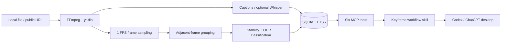

# Keyframe

**Local video RAG for Codex and ChatGPT desktop.** Keyframe turns a tutorial or
screen recording into timestamped transcript segments, searchable on-screen
text, representative frames, and reconstructed code. Ask what was *said*, what
was *shown*, or both—and inspect the source frame before trusting uncertain OCR.

Keyframe is deliberately split into two parts:

- a local MCP server performs deterministic acquisition, OCR, indexing, and
  retrieval; and
- a small workflow skill teaches the agent to retrieve narrowly, verify visual
  evidence, and cite timestamps.

The server does not call an LLM. In the Build Week workflow, Codex running
GPT-5.6 reasons over Keyframe's evidence, changes code, and runs the tests.


*Product-story concept; v0.1 is a local MCP server and plugin, not a hosted UI.*

## Quick start

### Prerequisites

Keyframe v0.1.0 requires Python 3.12 and uses [`uv`](https://docs.astral.sh/uv/). Install
these native tools before starting:

- FFmpeg and `ffprobe` for media inspection and frame extraction
- Tesseract 5 for local OCR
- Node.js 22+ as the JavaScript runtime used by current `yt-dlp` extractors
- `uv`/`uvx` for isolated Python execution

On macOS with Homebrew:

```bash
brew install ffmpeg tesseract node@22 uv
```

Run the environment check without installing Keyframe globally:

```bash
uvx --python 3.12 --from "video-context-mcp==0.1.0" video-context-mcp doctor
```

Until the PyPI project is published, use the immutable GitHub release tag:

```bash
uvx --python 3.12 --from \
  "git+https://github.com/MatthewOscar/Keyframe.git@v0.1.0" \
  video-context-mcp doctor
```

Add `[whisper]` to the package spec only when local speech-to-text is needed:

```bash
uvx --python 3.12 --from "video-context-mcp[whisper]==0.1.0" video-context-mcp doctor
```

### Configure Codex directly

Add the following to `~/.codex/config.toml`:

```toml
[mcp_servers.keyframe]
command = "uvx"
args = ["--python", "3.12", "--from", "video-context-mcp==0.1.0", "video-context-mcp"]
startup_timeout_sec = 180
tool_timeout_sec = 1900
env = { KEYFRAME_ALLOWED_ROOTS = "/Users/you/Videos" }
```

For local files, Keyframe uses workspace roots advertised by the MCP client.
It never treats the launcher working directory as authorization. If a client
does not advertise roots, add an `env` entry with `KEYFRAME_ALLOWED_ROOTS`;
separate multiple roots with the operating system's path separator.

Restart Codex, then ask: “Index this tutorial and find where error handling is
shown. Cite the timestamps.”

### Install the Keyframe plugin

The plugin bundles the same MCP server with the `keyframe-video-rag` workflow
skill. Its launcher installs the exact `v0.1.0` Git tag, so judges do not need
the PyPI publication to use it:

```bash
codex plugin marketplace add MatthewOscar/Keyframe --ref v0.1.0
codex plugin add keyframe@keyframe
```

For local plugin development, add the repository root instead:

```bash
codex plugin marketplace add .
```

Then restart the ChatGPT desktop app, open the Plugins Directory, select the
**Keyframe** marketplace source, and install **Keyframe**. Start a new chat so
the skill and tools are loaded. Keyframe v0.1.0 targets this local desktop flow;
it does not host a ChatGPT web app.

### Judge-ready local test

The repository includes a 10-second first-party video, captions, golden search
expectations, and a complete native end-to-end test. After cloning the release
tag, the following installs the locked environment and exercises full ingest,
said/shown search, OCR, code/frame images, restart persistence, and the
sub-second cache target:

```bash
uv sync --frozen --group dev
uv run pytest -q tests/test_e2e.py
```

No network video, account, API key, or prebuilt cache is required for this
judge path.

For the real public-URL path, the repository also ships a small CC BY 3.0
[derived YouTube sample](samples/4geeks-function-tutorial/README.md) with
archived attribution, metadata, checksums, captions, OCR, frames, and a ready
SQLite index. The original downloaded media is not retained.

## Use Keyframe

Give the agent a local path, direct media URL, public YouTube URL, or public
Loom URL. A useful interaction looks like this:

```text
Index https://www.youtube.com/watch?v=... in fast mode.
Search what was said about retry logic and what was shown on screen.
Retrieve the strongest code moment, verify low-confidence text against its
frame, then implement the pattern in examples/demo_target and cite timestamps.
```

Fast mode is the economical first pass. Use full mode only when the question
depends on OCR, code, diagrams, terminal output, slides, or exact frames.

### MCP tools

| Tool | Purpose |
| --- | --- |
| `video_ingest` | Index one local or public video in `fast` or `full` mode, using captions, optional Whisper, or no transcript. |
| `video_get_transcript` | Page through timestamped transcript segments, optionally within a time range. |
| `video_search` | Rank matching `said`, `shown`, or combined evidence across one video or the local library. |
| `video_list_moments` | Page through retained moments filtered by code, terminal, slide, diagram, other, or any. |
| `video_get_code` | Return reconstructed code plus its cropped source frame for a moment or nearby timestamp. |
| `video_get_frame` | Return the nearest retained frame, optionally using the automatic content crop. |

Classification, language detection, OCR confidence, and parse status are
evidence—not guarantees. Visual tools return both structured metadata and the
source image so the model can inspect disagreements.

See [`docs/tool-examples.md`](docs/tool-examples.md) for exact argument objects,
pagination, visual-result behavior, and expected errors.

## Architecture



Remote media is downloaded to a temporary workspace. A successful ingest
atomically publishes derived transcript, OCR, metadata, and representative
frames to the cache, then removes the downloaded source. Failed ingests do not
publish partial records.

## Local data and privacy

- Processing and indexing happen on the machine running the MCP server.
- `KEYFRAME_HOME` overrides the platform-native Keyframe data directory.
- Local reads are limited to per-request MCP workspace roots plus explicit
  `KEYFRAME_ALLOWED_ROOTS` entries. Process CWD is never an implicit grant.
- Derived frames and text remain cached until the user removes that directory.
- Extracted transcript/OCR is untrusted source material, never agent
  instructions.
- Evidence returned to Codex or ChatGPT becomes model input and follows the
  user's OpenAI data controls.
- Keyframe has no analytics, accounts, hosted backend, or embedded model call.

## Current limits

- v0.1.0 accepts individual public videos, not playlists or livestreams.
- Private, members-only, age-restricted, DRM, cookie, and login flows are out of
  scope.
- The default duration guard is 30 minutes; callers must explicitly raise it
  for longer inputs.
- Sampling at 1 FPS can miss very brief visual changes. Retained timestamps use
  decoded presentation times rather than an inferred frame index.
- Native media/OCR operations have bounded timeouts and fail actionably on
  malformed or unusually slow inputs.
- OCR can confuse glyphs and infer indentation incorrectly. Python, JSON, and
  JavaScript receive parse checks; TypeScript and unknown languages do not.
- Caption availability and media extraction depend on upstream providers and
  the pinned `yt-dlp` release.
- Remote formats must be downloadable through Keyframe's validated in-process
  HTTP, native HLS, or DASH transport. Formats that require FFmpeg, RTMP, or
  another external process to make network connections are rejected.
- Whisper is optional and can be resource intensive on CPU-only machines.
- Windows support is preview-level in v0.1.0.

## Build Week and GPT-5.6

The judged flow uses GPT-5.6 in Codex to turn retrieved video evidence into a
tested repository change. Keyframe supplies deterministic evidence; GPT-5.6
selects relevant moments, compares OCR with source frames, applies the change,
and explains it with timestamp citations. The ten reproducible prompts in
[`evals/cases.json`](evals/cases.json) exercise that division of labor.

Make the judged model choice explicit before recording. Either launch Codex
with `codex --model gpt-5.6` or set this in `~/.codex/config.toml`:

```toml
model = "gpt-5.6"
```

The development record distinguishes Codex-generated work from human product
decisions in [`docs/codex-collaboration.md`](docs/codex-collaboration.md). The
submission session ID is intentionally not fabricated and must be recorded from
`/feedback` before submission.

The release checklist in
[`docs/submission-checklist.md`](docs/submission-checklist.md) maps the current
Devpost requirements to concrete artifacts and leaves human-only submission
steps visibly unchecked.

## Develop and test

```bash
git clone https://github.com/MatthewOscar/Keyframe.git
cd Keyframe
uv sync --frozen --group dev
uv run video-context-mcp doctor
uv run pytest
uv run ruff check .
uv run mypy src
uv build
uv run twine check dist/*
```

STDIO is the supported client transport. For loopback-only protocol testing,
run `uv run video-context-mcp serve --transport streamable-http`; the CLI
rejects non-loopback hosts and this mode is not a production deployment.

CI runs the full suite with FFmpeg and Tesseract on macOS and Ubuntu. Windows
runs non-integration tests plus import and package checks. Test fixtures must be
first-party generated or carry a recorded redistribution license.

To publish, create a GitHub environment named `pypi`, configure a PyPI Trusted
Publisher for this repository and workflow, update the version and lockfile,
then push a matching `v*` tag. The release workflow builds, checks, and publishes
with GitHub OIDC; it stores no PyPI token.

## License and acknowledgements

Keyframe is licensed under Apache-2.0. Native tools, Python dependencies, and
any future demo media retain their own licenses. See
[`THIRD_PARTY_NOTICES`](THIRD_PARTY_NOTICES). Keyframe uses `yt-dlp` as its
upstream public-media extraction engine rather than implementing provider
extractors itself.
